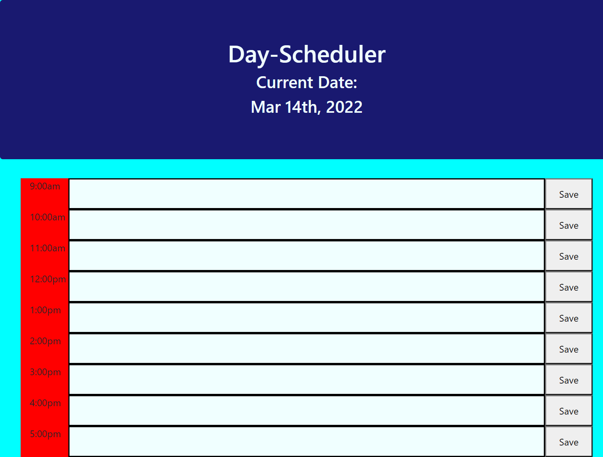

# day-scheduler

## Task
I created a Day-Planner , by using HTML, CSS and JS. I used various functions and global variables to make the quiz functional. I also used EventListeners to activate some functions by a click of a button. 

I used some of my old work and these websites for more information:  

https://www.w3schools.com/

https://developer.mozilla.org/en-US/docs/Web/JavaScript

https://stackoverflow.com/

https://getbootstrap.com/

https://api.jquery.com/

 I also had help from my friend Rogelio Sandoval. 

 ## Final Product

## Links

[Github pages](https://github.com/GustavoTijerino1/day-scheduler)

[Official Website](https://gustavotijerino1.github.io/day-scheduler/)
